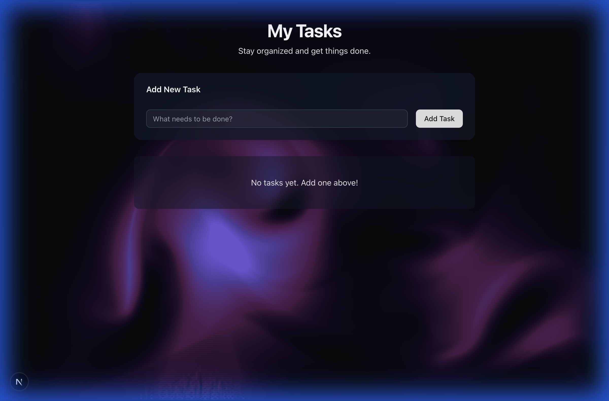
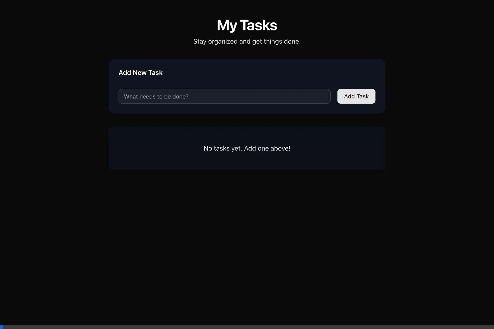

# My Tasks - Todo App | Antigravity

A modern, feature-rich Todo List application built with Next.js 16, featuring dark mode, smooth animations, and a beautiful LiquidEther background.



## ✨ Features

### Core Functionality

- ✅ **Add Todo**: Create tasks using the input field and "Add Task" button or Enter key
- ✅ **Toggle Complete**: Mark tasks as done with checkbox (auto-moves to bottom!)
- ✅ **Edit Tasks**: Modify todo content inline with edit button
- ✅ **Delete Tasks**: Remove todos with confirmation dialog
- ✅ **Auto-Sort**: Uncompleted tasks stay on top, completed at bottom
- ✅ **Timestamps**: Creation date/time displayed in Indonesian format

### UI/UX Highlights

- 🌙 **Dark Mode**: Beautiful dark theme by default
- ✨ **Smooth Animations**: Framer Motion for all interactions
- 🎨 **LiquidEther Background**: Animated fluid background
- 💎 **Glassmorphism**: Semi-transparent cards with backdrop blur
- 🔄 **Smart Sorting**: Completed todos automatically slide to bottom

## 🛠 Tech Stack

- **Framework**: Next.js 16 (App Router)
- **UI Components**: shadcn/ui + Tailwind CSS v4
- **Database**: SQLite with Prisma 7
- **Animations**: Framer Motion
- **Styling**: Dark mode + Glassmorphism effects

## 🚀 Quick Start

```bash
# Install dependencies
npm install

# Setup database
npx prisma migrate dev --name init

# Start development server
npm run dev
```

Visit **http://localhost:3000** (or port shown in terminal)

## 📦 Project Structure

```
src/
├── app/
│   ├── actions.ts       # Server actions (CRUD)
│   ├── layout.tsx       # Root layout (dark mode)
│   └── page.tsx         # Main todo page
├── components/
│   ├── todo-item.tsx    # Animated todo item
│   ├── LiquidEther.tsx  # Background animation
│   └── ui/              # shadcn/ui components
prisma/
└── schema.prisma        # Database schema
```

## 🎨 Key Features Explained

### Auto-Sorting

When you check a todo, it smoothly animates to the bottom of the list. Uncompleted todos always stay on top, sorted by creation date.

### Smooth Animations

- **Initial**: Todos fade in and slide from top
- **Reorder**: 300ms smooth transition when moving
- **Complete**: Slides to bottom with ease-in-out
- **Delete**: Fades out and slides left

### Dark Mode Design

- Custom dark color scheme
- Glassmorphism effects (semi-transparent backgrounds)
- Optimized contrast for readability
- Purple/pink gradient background

## 🔧 Development

### Build for Production

```bash
npm run build
npm start
```

### Database Commands

```bash
# Generate Prisma Client
npx prisma generate

# View database in Prisma Studio
npx prisma studio
```

## 📸 Screenshots

### Dark Mode Interface



## ✅ Tested & Verified

- ✅ Build passes (`npm run build`)
- ✅ All CRUD operations working
- ✅ Animations smooth and performant
- ✅ No console errors or warnings
- ✅ TypeScript types correct
- ✅ Clean, maintainable code

---

**Using Next.js, shadcn/ui, and Framer Motion**
